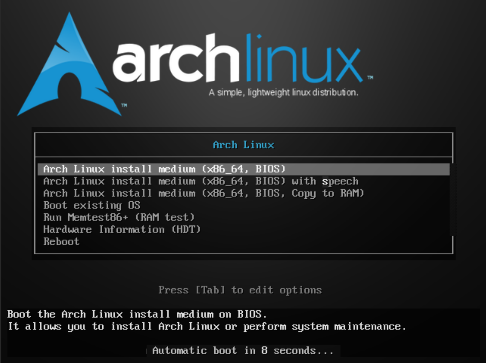
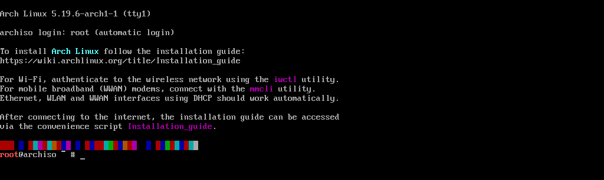

# Part 1 (Short Part): Customizing Arch Linux

This section will focus on a custom installation of Arch Linux; there will be a lot of code and, 
above all, many steps to go through before the operating system is up and running. Let's get started...

## Layer zero : Required

To get started, we’ll need the following items:
- A bootable USB drive (the operating system installer);
- A laptop or desktop computer;
- An Internet connection (Wi-Fi or Ethernet).

## Layer one : bootable USB drive

First, please download the [Rufus](https://rufus.ie/), 
which we will use to format the USB drive and install the ISO file on it. Next, 
please download the latest version of [Arch Linux](https://archlinux.org/) (This will be an ISO file.). 
Finally, open Rufus and use the settings shown in the screenshot : 

Once the settings are complete, please click the “Start” button. 
Click “Yes” in response to the warning, and let the bootable USB drive be created.
Once the USB drive is ready, we can move on to the next step.

## Layer two : Pre-install
To get started with the [BIOS](https://en.wikipedia.org/wiki/BIOS), 
please disable [Secure Boot](https://support.microsoft.com/en-us/windows/windows-11-and-secure-boot-a8ff1202-c0d9-42f5-940f-843abef64fad) (this feature blocks unsigned installations). 
Once you’ve done that, save the settings and select your USB drive, which should be plugged into your PC (of course).

Once you have booted from the USB drive, you will have two options: 
- Arch Linux install medium (x86_64, UEFI/BIOS)
- Arch Linux install medium (x86_64, UEFI/BIOS) with speech

Please select the **first option**

**Note: Depending on your computer, you will have either BIOS or UEFI. The menus are different (here is an example of a menu)**

## Layer two.one : install Arch Linux part 1

Once you've selected and loaded the files, you'll see the first installation screen 

First, we're going to set up the internet, so please enter the following commands:
```bash
$ loadkeys fr/en/de # switch keyboard language
$ iwctl # wireless connection utility
[iwd]$ device list # wlan0 or ...
[iwd]$ station "device" get-networks # shows networks near you
[iwd]$ station "device" connect "network" # If there is a password, it will ask you to enter it
[iwd]$ exit # exit the iwd interface
$ ping www.google.com # Test Internet connection + DNS resolution (ICMP protocol)
$ archinstall # démarre le programme d'installation
```
**Note : For Ethernet cables, you can run the lines related to iwd**


## layer two.two : install Arch Linux part 2

- Archinstall language
  - Language : English (100%)
 
- Locales
  - Keyboard layout : ******
  - Locale language: ******
  - Locale encoding : ******

- Mirrors and repositories
  - Select region : France
  - Add custom servers : void
  - Optionnal repositories : all
 
- Disk configuration --> Partitionning --> Use a best-effort default partition layout --> ext4 --> no --> Disk encryption --> Encryption type --> LUKS --> Encryption password --> Partitions

- Swap : no

- Bootloader : Limine

- Kernels : Linux, linux-lts

- Hostname : ******

- Authentification :
  - Root password : ******
  - User account : Add a user --> Username --> Password --> yes (sudo)

- Profile : minimal

- Applications :
  - Bluetooth : Disabled
  - Audio : No audio server
  - Print service : Disabled
  - Power management : power-profiles-daemon

- Network configuration : Use Network Manager (default backend)

- Additionnal packages : no (skip)

- Timezone : ******

- Automatic time sync (MTP) : Enable

**Note : A sequence of 6 asterisks indicates the user's choice**

Once you've made the settings, click the “Install” line and finally, you can click “Reboot system,” which will mark the end of this section

# End section
