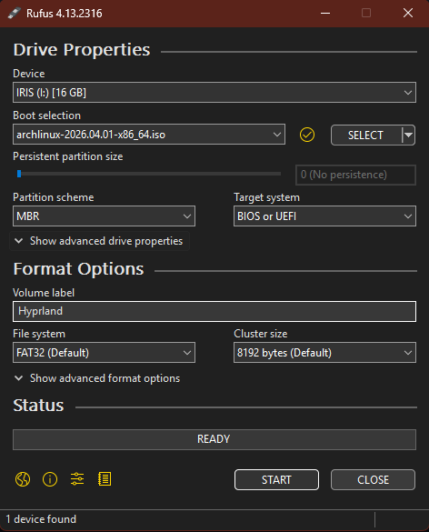

# Part 1 (Short Part): Customizing Arch Linux

This section will focus on a custom installation of Arch Linux; there will be a lot of code and, 
above all, many steps to go through before the operating system is up and running. Let's get started...

## Layer zero : Required

To get started, we’ll need the following items:
- A bootable USB drive (the operating system installer);
- A laptop or desktop computer;
- An Internet connection (Wi-Fi or Ethernet).

## Layer one : bootable USB drive
### Windows Instructions: 

First, please download the [Rufus](https://rufus.ie/), 
which we will use to format the USB drive and install the ISO file on it. Next, 
please download the latest version of [Arch Linux](https://archlinux.org/) (This will be an ISO file.). 
Finally, open Rufus and use the settings shown in the 
